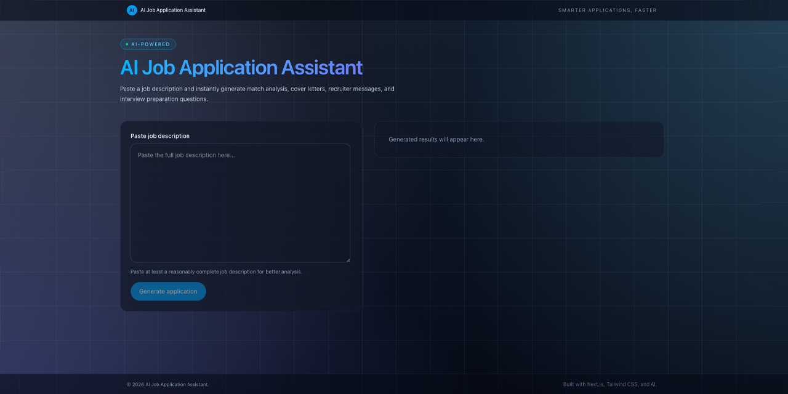

# AI Job Application Assistant

AI-powered web application that analyzes a job description and generates useful assets for job applications such as:

- Job match score
- Strengths and skill gaps
- Tailored cover letter
- Recruiter outreach message
- Interview preparation questions



This project demonstrates how AI can be integrated into a **Next.js production-style application** using structured output and validation.

---

## Features

- Analyze job descriptions  
- Calculate job match score  
- Identify strengths and missing skills  
- Generate tailored cover letters  
- Generate recruiter outreach messages  
- Generate interview questions  
- Structured AI output with validation  
- Clean modular architecture  

---

## Tech Stack

### Frontend

- Next.js (App Router)
- React
- TypeScript
- Tailwind CSS

### Backend

- Next.js API Routes
- Zod validation

### AI Integration

- OpenAI API
- Structured JSON responses

---

## How It Works

1. User pastes a job description.
2. The frontend sends the request to `/api/generate`.
3. The API validates the input using Zod.
4. The OpenAI API analyzes the job description.
5. The response is returned as structured JSON.
6. The UI displays:

- Match score  
- Strengths  
- Skill gaps  
- Cover letter  
- Recruiter message  
- Interview questions  

---

## Installation

Clone the repository.

```bash
git clone https://github.com/harkalopchan/ai-job-application-assistant.git
cd ai-job-application-assistant
```

Install dependencies.

```bash
npm install
```

---

## Environment Variables

Create a `.env.local` file in the project root.

```env
OPENAI_API_KEY=your_openai_api_key_here
OPENAI_MODEL=gpt-4.1-mini
```

---

## Run the Project

Start the development server.

```bash
npm run dev
```

Open the application in your browser.

```text
http://localhost:3000
```

---

## Example Output

### Match Score

```text
86%
```

### Strengths

- Strong React and Next.js experience
- Deep TypeScript knowledge
- Experience building scalable dashboards

### Skill Gaps

- Limited AWS infrastructure experience
- No GraphQL experience mentioned

### Recruiter Message

```text
Hi [Name],

I came across the Senior Frontend Engineer role at your company.
With 15+ years of experience building React and Next.js applications,
the role aligns closely with my background.

I'd love to connect and learn more about the team.

Best regards,
Harka
```

---

## Future Improvements

- Resume upload and analysis
- Job history tracking
- ATS keyword optimization
- PDF export for cover letters
- Authentication and user accounts
- Job board integration

---

## Security Notes

- OpenAI API keys are stored server-side  
- All requests are validated  
- AI responses are schema validated before rendering  

---

## Author

**Harka Man Tamang**

Senior Frontend Engineer  
React | Next.js | TypeScript  

GitHub  
https://github.com/harkalopchan  

LinkedIn  
https://linkedin.com/in/harkalopchan  

---

## License

MIT License